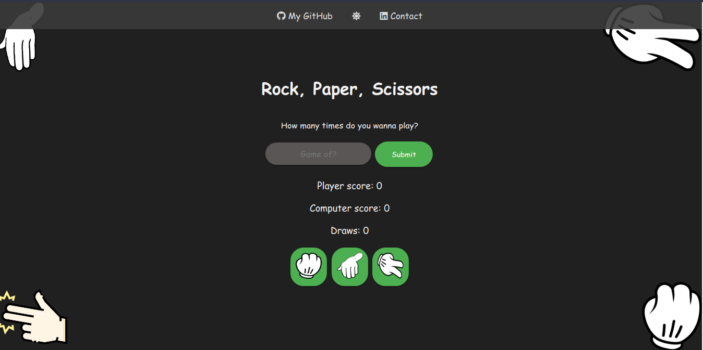
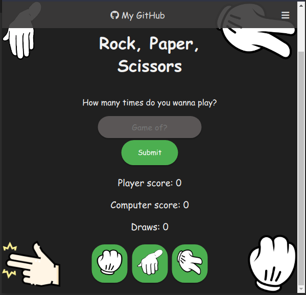
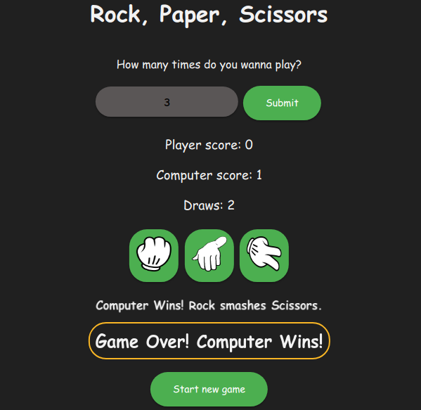

# Rock Paper Scissors #
A simple rock paper scissors game developed using HTML, CSS, and JavaScript.

## Table of Contents
* [Game Preview](#game-preview)
* [Features](#features)
* [Where to Play?](#where-to-play)
* [How to Play?](#how-to-play)
* [Dark/Light Mode](#dark-and-light-mode)
* [Creator](#author)
* [Credits](#dependencies)
* [License](#license)

## Game Preview

## Features
* Play as many games as you want
* Keep track of the scores and draws
* Responsive design with dark and light mode options
* Option to toggle between dark and light mode
* Custom icons for rock, paper, and scissors

## Where to Play?
* #### [GitHub Deployment](https://saurav-png.github.io/rock-paper-scissors/)
* 

## How to Play
* Input the number of games you want to play and hit "Submit".
* Click on the rock, paper, or scissors button to make your choice.
* The computer will randomly choose its move.
* The winner will be declared after all games have been played.

## Dark and Light Mode
You can toggle between dark and light modes by clicking on the sun icon in the navigation bar.

## Author
[Saurav Tiwari](https://www.github.com/saurav-png)

## Dependencies
* [Font Awesome](https://fontawesome.com/) [CDN link is included in `index.html`]
* The game icons were sourced from [seekpng.com](https://www.seekpng.com/) and [flaticon.com](https://www.flaticon.com).
*

## License
This project is licensed under the [MIT License](https://choosealicense.com/licenses/mit/).
